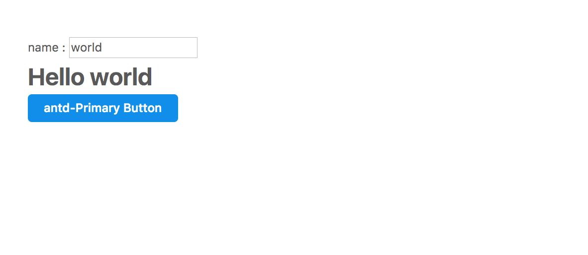

Ant design for Angular 1.x

Q: How to build web app with angularjs 1.x and ant-design?

A: This is a sample app would show how to use.

想用angular.js 和 ant-design 构建web? 这里提供一种基于webpack的构建方案:

  

## 步骤Steps：

1. git clone 

2. npm i

3. npm start

4. review code

## 构建步骤 Structure Steps：

1. add module
2. import antd.css,angular.js,etc
3. custom ui components as the angular usual！

## Todo add more components
